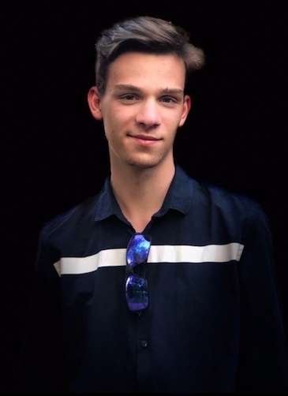



						Edouard Degeest
					  Développer Full Stack

Email : e.degeest@it-students.fr  
Téléphone : +33 7 83 90 03 20  
Pays et Ville : Gleizé (Villefranche sur Saône), France  
Age : 18 ans

-----
Bonjour, je m'appelle Edouard Degeest. 

Je suis étudiant à l'IT Akademy de Confluence
plus précisément en
cursus de Développeur Full Stack. Je suis né le 23 Octobre 2001.
Je recherche un travail dans le domaine de l'informatique.

## Mes Expériences : 

 - Stage de 3e chez VISEO Lyon
 - Patisserie Le FORCADO Bruxelles
 - OLITKIDS Lyon (déménagement)
 
 ## Cursus Scolaire : 
 
 - Collège Fénelon (Lyon)
 - Lycée Louis Armand (Villefranche sur Saône)

## Langages Informatiques : 

 - HTML : Pro
 - CSS : Pro
 - JavaScript : Expérimenté
 - PHP : Notion basique
 - SQL : Faible notion
 - Python : Expérimenté
 ------------------------------------------
 
## Langues Etrangères :
 
 - Anglais - 5 ans
 - Italien - 2 ans
 - Japonnais - 1 ans
 - Flammant - 2 ans